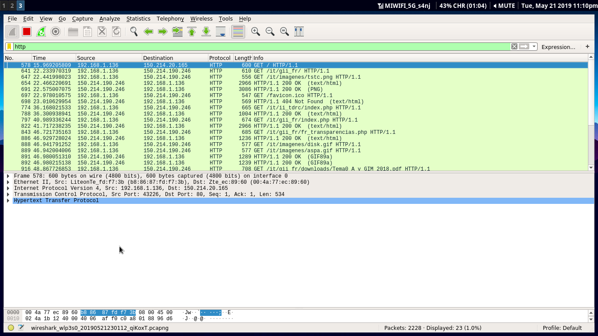

Instalar Wireshark y observar cómo fluye el tráfico de red en uno de los
servidores web mientras se le hacen peticiones HTTP... o en la red de casa.

# Solución

Para este ejercicio he decidido poner _wireshark_ a leer el tráfico mientras
accedia con el portatil a una página web. Es recomendable hacerlo en una que no
utilice HTTPS (sino HTTP) para poder ver bien que está pasando.  

Filtramos el tráfico HTTP y obtenemos algo así:

Si hacemos click en una de ellas podemos ver las diferentes capas del modelo
OSI. Nos iremos a la última capa que es la que nos interesa, la de HTTP:

Aquí podemos empezar a ver cabeceras HTTP como el host al que accedemos por si
quieremos cambiar la págino por ejemplo en función de si accedemos a
dominio.com o dominio.es; también las cookies que usamos, la cabecera Referer
que nos indica quien nos ha redirigido...

Por último, vamos a ver uno de los puntos fuertes de _wireshark_ en conexiones
HTTP. Como todo va en texto plano, si un usuario de nuestra red se conecta con
sus credenciales en una página, podemos verlas:

