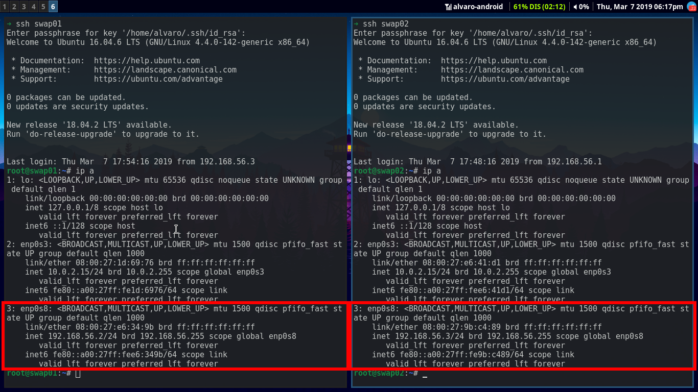
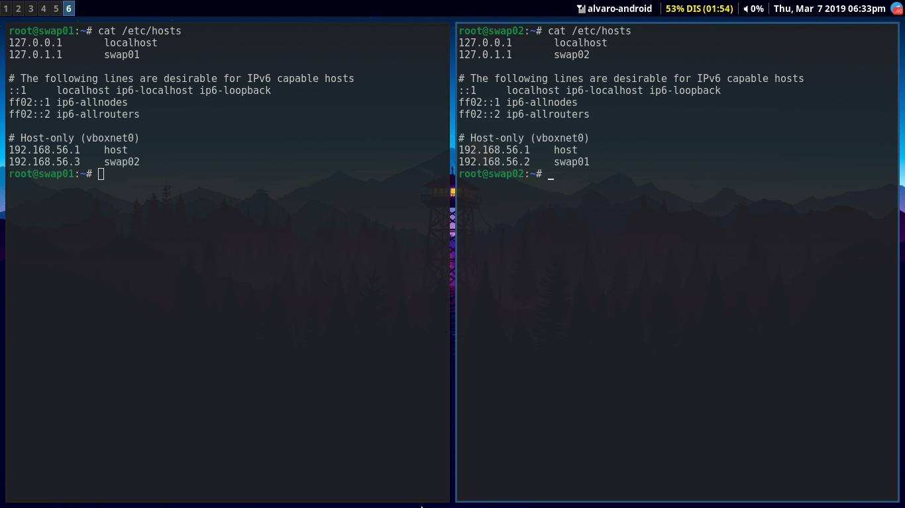
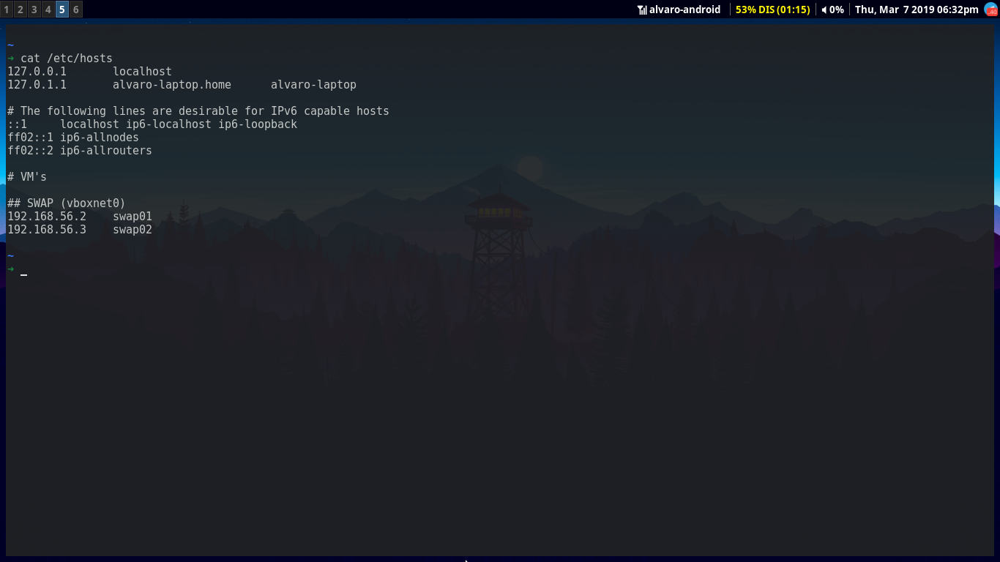
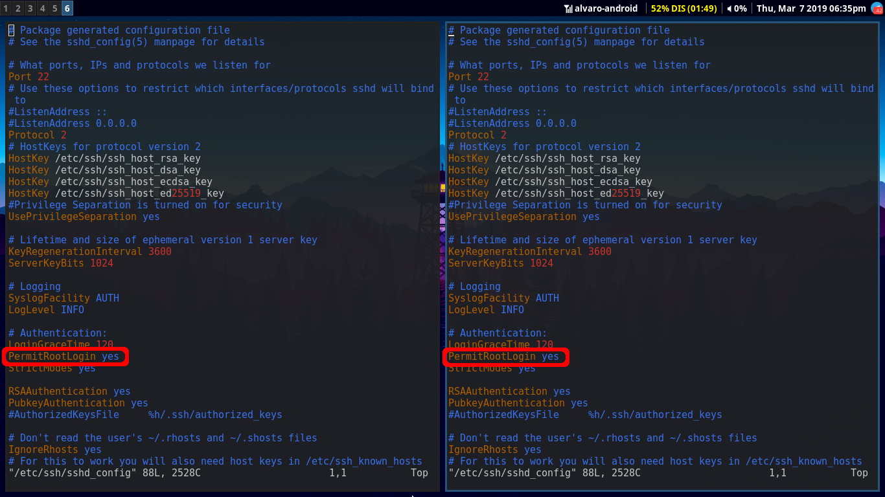
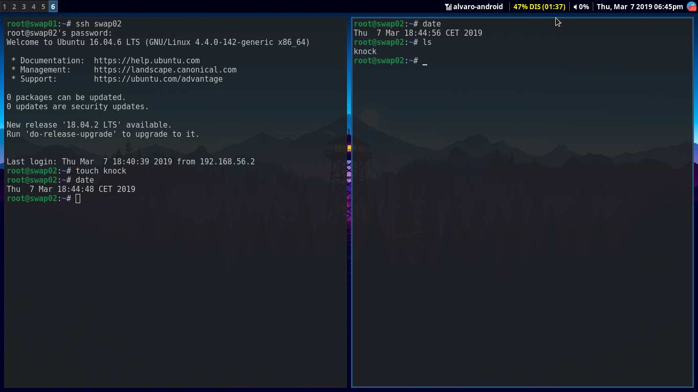
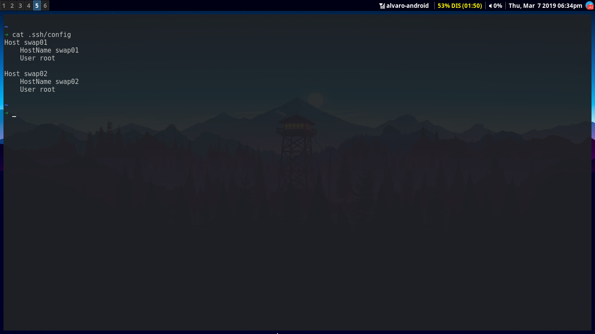
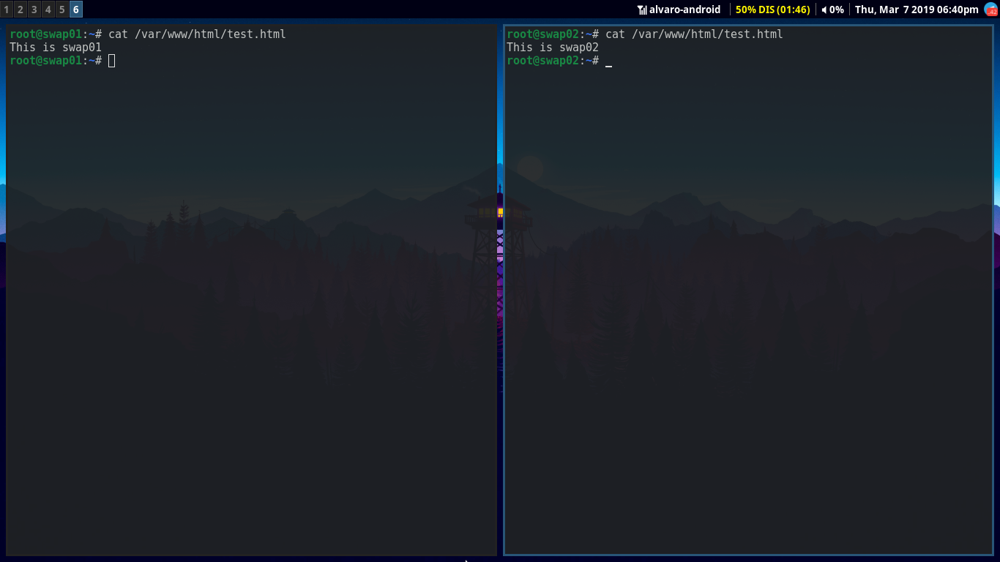
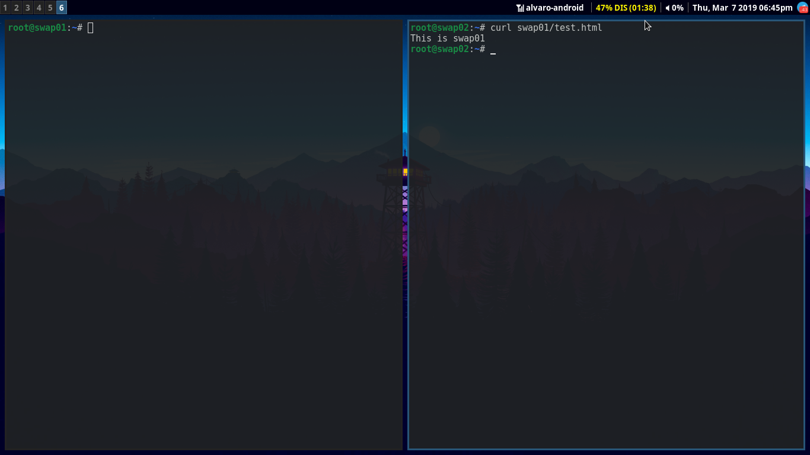

# Práctica 1. Preparación de las herramientas

Una vez instaladas las máquinas como nos indica el guión, tenemos que conseguir lo siguiente:
* Acceder por ssh de una máquina a la otra.
* Acceder mediante la herramienta curl de una máquina a la otra.

## Configuración básica de red
Lo primero que haremos será comprobar que la interfaz está bien configurada, para ello ejecutamos el comando *ip a*:

Podemos observar que la IP de las máquinas (en la interfaz que nos interesa) son 192.168.56.2 para swap01 y 192.168.56.3 para swap02. Para facilitar el seguimiento de las prácticas, modificaremos la tabla de hosts de todas las máquinas para dirigirnos a ellas con un alias (swap01 y swap02 para las máquinas virtuales y host para la máquina anfitrión). Para hacer esto deberemos editar el archivo */etc/hosts*:

## Configuración del servicio sshd
Como debemos acceder por ssh de una máquina a la otra y la mayor parte del tiempo estaremos como usuario root, el primer paso será modificar la configuración para poder conectarnos por ssh como usuario root directamente. Para ello editamos el archivo */etc/ssh/sshd_config* poniendo "*PermitRootLogin yes*":

Una vez modificado esto y recargando el servicio con *systemctl restart sshd* ya podríamos conectarnos directamente como root. Hecho esto, no deberíamos tener ningún problema al conectar las máquinas virtuales (siempre y cuando las hayamos configurado correctamente en la red). Adjuntamos una imagen donde podemos comprobar que funciona bien.

Como curiosidad, podemos hacer una pequeña configuración para conectarnos más cómodamente por ssh. Como ya sabemos, por defecto al conectarnos por ssh, si no indicamos un usuario, se nos intenta conectar al mismo con el que estamos conectados en ese momento (en mi caso alvaro). Para evitar tener que indicar poner *ssh root@swap01* y poder conectarnos como root por defecto, podemos crear el siguiente archivo en la ruta *~/.ssh/config*:

De esta forma, podríamos conectarnos a nuestras máquinas de manera inmediata mediante el comando *ssh swap01* o *ssh swap02*.

## Acceso mediante *curl*
Para acceder de una máquina a otra mediante curl no debemos hacer nada en especial. Para comprobar que todo funciona correctamente, crearemos un archivo *test.html* en nuestros servidores web bajo la ruta */var/www/html/*. Tendrán el siguiente contenido:

Ahora probaremos a hacer *curl* desde swap02 a swap01:

Como podemos comprobar, la petición se hace de manera correcta y se produce la conexión.
