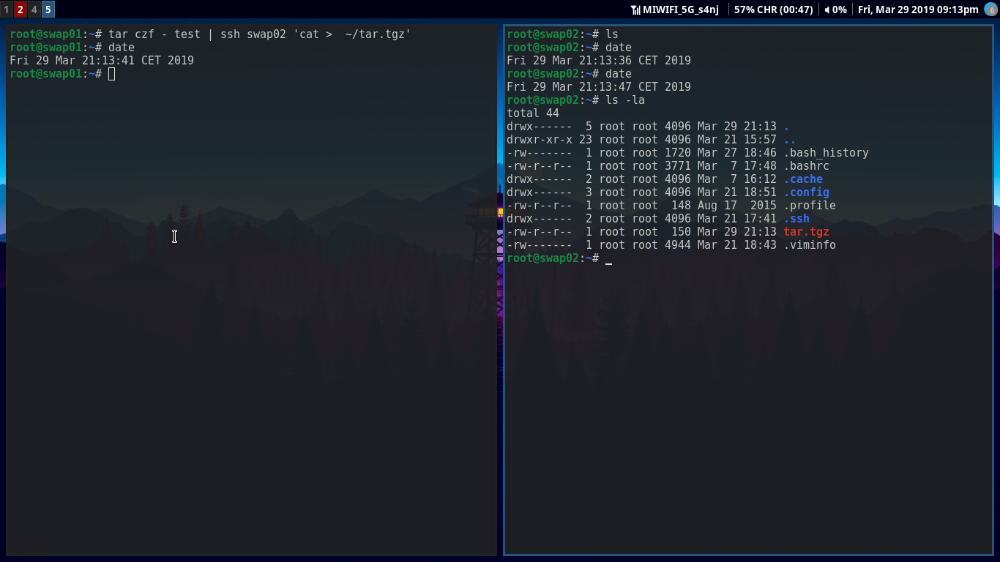
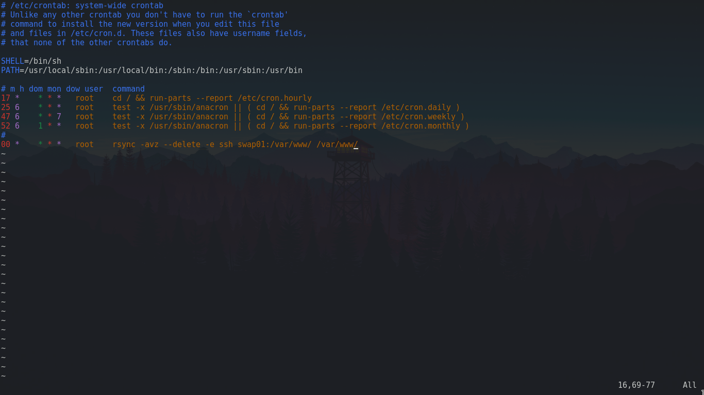

# Práctica 2. Clonar la información de un sitio web

Para completar esta práctica, debemos llevar a cabo las siguientes tareas:
- Copiar archivos por ssh
- Clonar contenido entre máquinas
- Configurar ssh para acceder a máquinas remotas sin contraseñas
- Establecer tareas en cron 

## Configurar ssh para acceder a máquinas remotas sin contraseña
Cambiaremos un poco el orden. En primer lugar configuraremos ssh para acceder a las máquinas sin contraseña. El motivo es simple: de esta manera trabajaremos de manera mucha más rápida y eficiente. Para ello haremos tal y como dice el guión, ejecutaremos la siguiente orden para generar una clave RSA: 
*ssh-keygen -b 4096 -t rsa*
Con *-b* indicamos de cuantos bits será la clave (por defecto usa 2048) y con *-t* el tipo de clave (por defecto ya utiliza RSA).
Una vez hecho esto, tendremos que añadir la clave como autorizada a la máquina a la cual queremos acceder por clave pública. Esto podría hacerse a mano escribiendo nuestra clave pública en *swap0x:.ssh/authorized_keys*, pero contamos con una herramienta que lo hace directamente por nosotros. Ejecutaremos lo siguiente:
*ssh-copy-id swap0x*
Al hacer este paso hay que tener en cuenta el usuario con el que nos conectamos, ya que será en esa cuenta a la que podremos conectarnos directamente mediante clave pública. También es posible que tengamos algún problema con los permisos. Si pasara basta con dejar la clave privada con los bits de permisos a 600 (solo lectura por el dueño, nosotros). Recordar que en la práctica 1 ya modificamos el servicio *sshd* para poder logearnos como root. Esto es indispensable si queremos inicar sesión como tal o usar cualquier servicio que use ssh por debajo.
Una vez hecho todo esto en todas los pares de máquinas (obviamente solo necesitamos generar un par de claves por máquina) ya podremos movernos libremente de una máquina a otro y usar cualquier servicio que use ssh (scp, rsync con ssh...) sin necesidad de contraseña.

## Copiar archivos por ssh
Para copiar archivos por ssh es muy sencillo. Hay varios métodos pero realizaremos el que se explica en el guión. Además, nos servirá para comprobar que efectivamente podemos copiar archivos sin contraseña. Haremos lo siguiente:

Como podemos ver en la imágen, ahora tenemos el archivo en la otra máquina y en ningún momento hemos introducido ninguna contraseña. Obviamente si al crear el par de claves RSA utilizamos un passphrase si que pedirá éste, pero aunque es aconsejable, no se ha hecho para agilizar el trabajo y la claridad del mismo (esta passphrase luego puede almacenarse igualmente en memoria con *ssh-agent* para que no la pida y podamos automatizar tareas). 

## Clonar contenido entre máquinas
Para clonar contenido entre máquinas y mantenerlas idénticas una herramienta muy común es rsync. Es muy útil, potente, y además suele venir instalada en casi cualquier distribución. Para usarla ejecutaremos el siguiente comando:
*rsync -avz --delete -e ssh swap01:/var/www/ /var/www/*
Con *-a* indicamos que sincronizamos a nivel de archivo, con *-v* el modo verbose, *-z* para comprimir y --delete para no solo añadir archivos, sino también para eliminarlos si se da el caso.
La idea es que usemos este comando desde la máquina *swap02*, pues esta sería la máquina "secundaria" que no está siempre en funcinamiento o que, al menos, se supone que es la que tiene menos carga. Ella sería la encargada de actualizarse con *swap01* para que la máquina principal se mantenga sirviendo páginas y no tenga que preocuparse también de la sincronización.

## Establecer tareas en cron 
Para esta última tarea, automatizaremos que *swap02* se sincronice con *swap01* a cada hora. Para ello, utilizaremos el comando del apartado anterior con la sintaxis de cron. Bastará con modificar */etc/crontab* de la siguiente manera:

Si todo ha ido bien, bastará con modificar los archivos de *swap01* o *swap02* y ver que, cuando llega la hora en punto, se sincronizarán pasando a estar los dos como en *swap01*
