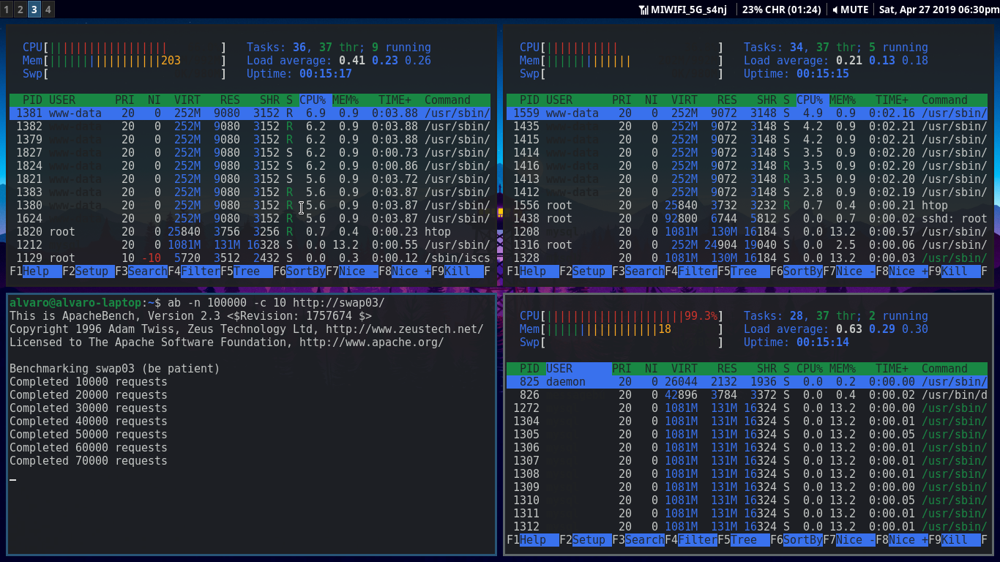
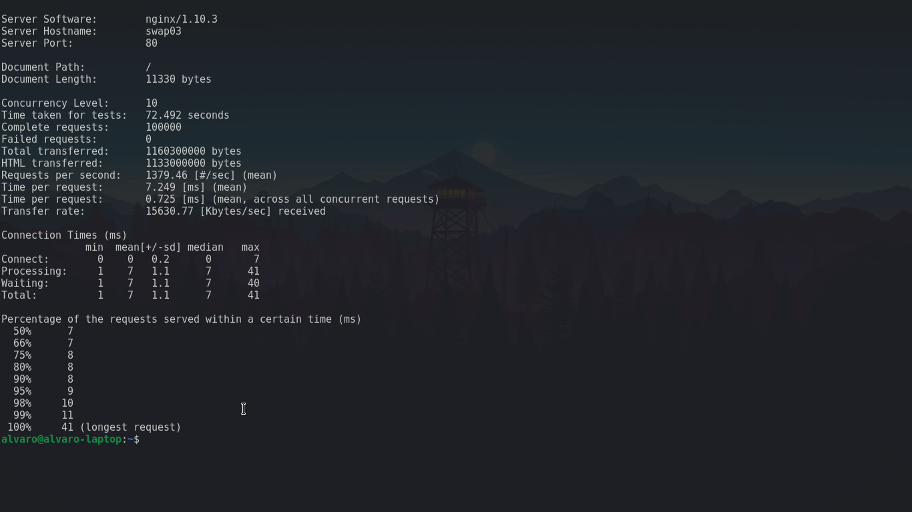
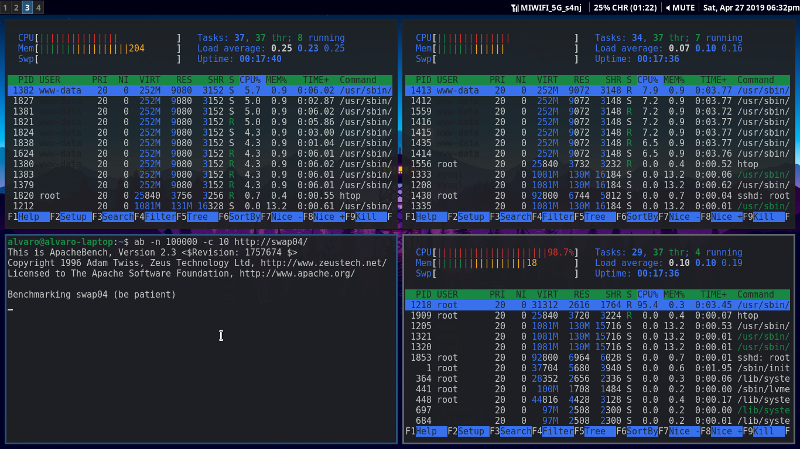
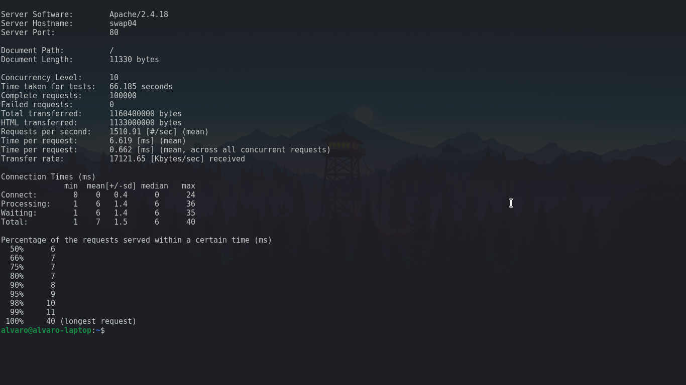

# Práctica 3. Balanceo de carga

Para completar esta práctica, debemos llevar a cabo las siguientes tareas:
- Configurar una máquina e instalar nginx como balanceador de carga
- Configurar una máquina e instalar haproxy como balanceador de carga
- Someter la granja web a una alta carga, generada con la herramienta Apache
  Benchmark, teniendo primero nginx y después haproxy

## Planificando la práctica
Lo primero que haremos será pensar en como organizar las máquinas virtuales para
esta práctica. Tendremos 2 máquinas como servidores finales y, al menos, otro
más para balanceo de carga. En mi caso he decidido tener una máquina virtual
para cada balanceador de carga, es decir, una para nginx y otra para haproxy. De
esta manera, es más sencillo hacer pruebas con los distintos balanceadores sin
tener que estar parando e iniciando los servicios constantemente, sino que
simplemente iremos abriendo y cerrando conexiones ssh. 
Organizaremos las ventanas de la siguiente manera: 

Por útilmo, para comprobar que el balanceo se hace como esperamos, cada servidor
final tendrá un index.html diferente. No debemos olvidarnos de quitar
sincronización automática que hicimos en la práctica anterior para evitar
quebraderos de cabeza pensando que solo esta dirigiendo tráfico hacia una de las
máquinas. 

## Configurando nginx
Como indica el guión, lo primero que debemos hacer es instalar nginx.
```bash
sudo apt install nginx
```
Iremos al archivo de configuración de nginx en _/etc/nginx/conf.d/default.conf_
y lo dejaremos tal que así:

Esta configuración utiliza _round robin_ dándole más peso a _swap01_, nuestro
servidor que suponemos más potente. 
Recordamos que en prácticas anteriores, modificamos el archivo _/etc/hosts_ para
evitar lidiar con IPs constantemente y usar un hostname. _swap01_ correspondería
al servidor final 1, _swap02_ al servidor final 2 y _swap03_ al balanceador de
carga con nginx. 
Para completar la configuración, bastaría con eliminar el enlace simbólico
_/etc/nginx/sites-enabled/default_ o bien comentar la linea de
_/etc/nginx/nginx.conf_ en la que se tiene en cuenta esta configuración tal y
como dice el guión. 
Hecho esto podemos iniciar el servicio:
```bash
sudo systemctl start nginx
```

## Configurando haproxy
Como indica el guión, lo primero que debemos hacer es instalar haproxy.
```bash
sudo apt install haproxy
```

Crearemos nuestro archivo de configuración en _/etc/haproxy/haproxy.cfg_ de la
siguiente manera:

En este caso, el balanceador de carga con haproxy correspondería con _swap04_. 
Con esto ya solo nos faltaría iniciar el servicio. Lo más cómodo es usar
_systemctl_ tanto para activarlo como para hacer que lo haga con cada inicio del
sistema:
```bash
sudo systemctl start haproxy
sudo systemctl enable haproxy
```
De esta manera, cuando queramos pararlo, lo haremos con
```bash
sudo systemctl stop haproxy
```

## Simulando carga contra los balanceadores de carga
En este punto, simularemos una gran carga de peticiones contra cada uno de los
balanceadores de carga y comprobaremos cual ofrece un mejor rendimiento. En
primer lugar, instalaremos _htop_ para comprobar como afectan las peticiones a
las 3 máquinas afectadas en cada situación (los 2 servidores finales y el
balanceador en cuestión): 
```bash
sudo apt install htop
```
También necesitamos una herramienta que nos permita hacer este tipo de
benchmarking. Utilizaremos _ab_ de Apache. Relizaremos una carga de 100000
peticiones con una concurrencia de 10 hebras desde nuestra máquina host. 
El primer balanceador que mediremos será nginx. Estas imágenes corresponde al
durante y al resultado de la simulación respectivamente:


Podemos comprobar que _swap01_ trabaja el doble que _swap02_ ya que le pusimos
el doble de peso. 
Ahora lo haremos con haproxy obteniendo las mismas imágenes:


Con haproxy sin embargo dejamos el mismo peso para ambos servidores, por lo que
el resultado de _htop_ para _swap01_ y _swap02_ es casi idéntico. 
Tras ver los datos, podemos ver que haproxy da mejores resultados. Realizaremos
otra carga indicando a nginx que ambos servidores finales tienen el mismo peso a
ver si cambia algo:

A pesar de igualar las condiciones, haproxy nos sigue dando mejores resultado
aunque por poco (1-2 segundo de media más rapido)
