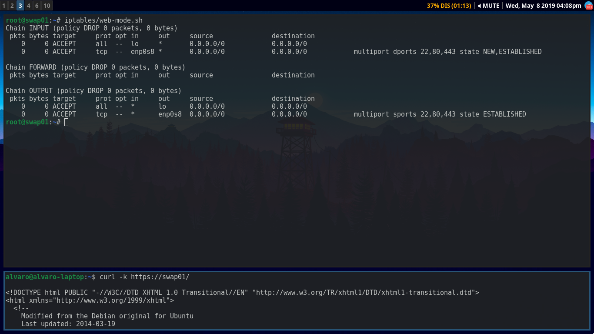

# Práctica 4. Asegurar la granja web

Para completar esta práctica, debemos llevar a cabo las siguientes tareas:
-   Instalar un certificado SSL para configurar el acceso HTTPS a los servidores
-   Configurar las reglas del cortafuegos para proteger la granja web

## Generando el certificado SSL autofirmado
Lo primero que debemos hacer es generar el certificado SSL que usaremos para
todas nuestras máquinas. Repasemos cuales son:
-   _swap01_: Servidor final 1.
-   _swap02_: Servidor final 2.
-   _swap03_: Balanceador de carga (Nginx).

Para generar el certificado ejecutaremos lo siguiente:
```bash
a2enmod ssl # Activamos el módulo _ssl_ de apache
mkdir /etc/apache2/ssl  # Creamos un directorio para almacenar el certificado
openssl req -x509 -nodes -days 365 -newkey rsa:20480 \
-keyout /etc/apache2/ssl/apache.key -out /etc/apache2/ssl/apache.crt  # Generamos el par de certificado y llave
```

Cuando lo ejecutamos nos pedirá una serie de datos. En mi caso los he rellenado
así, cada uno introducirá la información que necesite.

## Instalando el certificado
Una vez que tenemos el certificado (le llamamos así para abreviar, pero
realmente es una pareja de clave y certificado), toca instalarlo. Esto variará
en función del servidor web que estemos utilizando (Nginx, Apache...). En esta
memoria lo instalaremos tanto en Apache, que es lo que tenemos instalado en los
servidores finales, como en Nginx, que es lo que utilizamos como balanceador de
carga.

### Apache
Para apache debemos irnos a _/etc/apache2/sites-availables/default-ssl_.
Añadimos a continuación de la linea _SSLEngine on_ lo siguiente:
```
SSLCertificateFile      /etc/apache2/ssl/apache.crt
SSLCertificateKeyFile   /etc/apache2/ssl/apache.key
```
Nos quedaría algo tal que así:


Esto le indica a Apache donde buscar los archivos del certificado y la clave. Ya
solo queda activar el sitio e indicarle a Apache que vuelva a leer sus archivos
de configuración:
```bash
a2ensite default-ssl
systemctl reload apache2
```
Una vez que hemos hecho los pasos anteriores, ya tendremos https listo para
funcionar en nuestro servidor. Lo comprobamos haciendo una petición https
mediante _curl_:
```bash
curl -k https://swap01/
```
Obtenemos la siguiente salida:


Ya tenemos configurado en _swap01_ https. Pero esto es una granja web, debemos
de configurarlo en todos los servidores finales (además de en el balanceador de
carga).  

Para tener https funcionando también en _swap02_, basta con realizar los mismos
pasos... pero, RECUERDA, usamos el mismo certificado que ya hemos creado.
Podemos copiarlo de un servidor a otro por ejemplo mediante _scp_ desde _swap01_:
```bash
scp -r /etc/apache2/ssl swap02:/etc/apache2/
```
Seguimos los pasos de instalación que usamos para _swap01_, y ya tendríamos
https funcionando:


### Nginx
Una vez que tenemos los servidores finales con https, tenemos que configurar
Nginx para que sepa como balancear este tipo de tráfico.  

Lo primero es volver a mover el certificado que ya generamos anteriormente a
_swap03_. Para ello:
```bash
scp -r /etc/apache2/ssl swap02:/etc/nginx/ssl
```
El siguiente paso será hacer la instalación en Nginx. Tendremos que irnos al
archivo _/etc/nginx/conf.d/default.conf_ y añadir lo siguiente:
```
listen 443 ssl;
ssl on;
ssl_certificate         /etc/nginx/ssl/apache.crt
ssl_certificate_key     /etc/nginx/ssl/apache.crt
```
Nos quedaría algo asi:

Observamos que ahora tenemos dos bloques _server_. Uno escucha las peticiones
https y las pasa a los servidores finales tambien por https. El otro escucha
peticiones http que devuelve un 301 (nos redirige a https).

Si hacemos una petición, podemos ver que funciona:

Y además, como hemos dicho antes, al no haber quitado que escuche en el puerto
80, podemos seguir haciendo peticiones http:

Con esto habríamos acabado con el tema del certificado.

## Configuración del cortafuegos
Llegó la hora del firewall. Configurando el cortafuegos conseguiremos filtrar
los paquetes que queramos para evitar conexiones indeseadas. En nuestro caso
estamos tratando con páginas web, por lo que unicamente nos interesa que se nos
conecten desde el puerto 80 o el puerto 443. Nosotros para las prácticas vamos a
permitir también las conexiones al puerto 22 (ssh) para poder configurar el
servidor, pero en un entorno real solo se aconseja permitir este tipo de
conexiones desde redes (interfaces para _iptables_) muy seguras a la que solo tú
tienes acceso.  

Para esta parte de la práctica he hecho dos scripts. El primero permite solo el
tráfico que nos interesa en un servidor web, lo que hemos comentado antes. El
segundo lo permite todo.
```bash
#!/bin/bash
# web-mode.sh

# Limpia la tabla
iptables -F
iptables -X
iptables -Z
iptables -t nat -F

# Prohíbe por defecto todo el tráfico
iptables -P INPUT DROP
iptables -P OUTPUT DROP
iptables -P FORWARD DROP

# Permite entrada y salida de todo el tráfico en la interfaz lo
iptables -A INPUT -i lo -j ACCEPT
iptables -A OUTPUT -o lo -j ACCEPT

# Permite entrada y salida de tráfico ssh, http y https (o los servicios que
# corran en esos puertos en nuestro servidor) únicamente en la interfaz enp0s8
iptables -A INPUT -i enp0s8 -p tcp -m multiport --dports 22,80,443 -m state \
--state NEW,ESTABLISHED -j ACCEPT
iptables -A OUTPUT -o enp0s8 -p tcp -m multiport --sports 22,80,443 -m state \
--state ESTABLISHED -j ACCEPT

# Muestra la tabla
iptables -L -n -v
```

```bash
#!/bin/bash
# accept-all.sh

# Limpia la tabla
iptables -F
iptables -X
iptables -Z
iptables -t nat -F

# Permite por defecto todo el tráfico
iptables -P INPUT ACCEPT
iptables -P OUTPUT ACCEPT
iptables -P FORWARD ACCEPT

# Muestra la tabla
iptables -L -n -v
```


Son scripts _bash_, por lo que cuando corramos ejecutará cada una de las líneas
secuencialmente. Comprobamos que funciona:



Sin embargo, si llamamos al otro script:


El motivo por el que he hecho los dos scripts es el siguiente:

Se nos pide que se ejecute nuestro script cada vez que se inicie el sistema (la
configuración de _iptables_ no es persistente). Una de las maneras de hacerlo
(para mí la mejor) es creando un servicio de _systemd_ para así poder manejarlo
como tal con _systemctl_. ¿Por qué utilizar esto? Pues porque _systemctl_ tiene
llamadas ya implementadas que nos serán muy útiles:
-   systemctl _start_ \<servicio\>    # Inicia un servicio
-   systemctl _stop_ \<servicio\>     # Detener un servicio
-   systemctl _enable_ \<servicio\>   # Habilita un servicio para que inicie con
    el sistema.  

Lo interesante viene cuando a un servicio de _systemd_ podemos indicarle que
script ejecutar para iniciar el servicio y que script ejecutar para pararlo. Es
por eso que creamos dos scripts: uno que permite el tráfico específico para un
servidor web (equivaldrá a iniciar el servicio) y uno que lo permite todo
(equivaldrá a detener el servicio).  

Una vez que sabemos la teoría, quedaría instalar el servicio. Es muy fácil, solo
debemos crear el archivo _/etc/systemd/system/iptables-web.service_ y añadirle
el siguiente contenido:
```
[Unit]
Description=iptables script for a web server configuration

[Service]
Type=oneshot
ExecStart=/root/iptables/web-mode.sh
ExecStop=/root/iptables/accept-all.sh
RemainAfterExit=yes

[Install]
WantedBy=multi-user.target
```
Vamos a ver qué son las variables que nos interesan:
-   Description. Es la descripción que le queramos poner a nuestro servicio
-   Type. Tipo de servicio. En nuestro caso es _oneshot_ porque no es un
    servicio al uso, que nunca para de ejecutarse hasta que lo paremos, sino que
    llega un momento en el que acaba de ejecutarse.
-   ExecStart. Script que se ejecuta al iniciar el servicio.
-   ExecEnd. Script que se ejecuta al parar el servicio.
-   RemainAfterExit. Nos permite que, aunque el script de inicio haya terminado,
    se siga marcando el servicio como activo.

Ahora que ya entendemos como funcionan los servicios de _systemd_, solo nos
queda ejecutarlo. Para hacer que se permitan únicamente los paquetes que nos
interesan para nuestra web, haremos:
```bash
systemctl start iptables-web
```
Si queremos que esto se haga cada vez que inicie el sistema:
```bash
systemctl enable iptables-web
```
Si en algún momento nos interesa evitar que se filtren paquetes:
```bash
systemctl stop iptables-web
```
