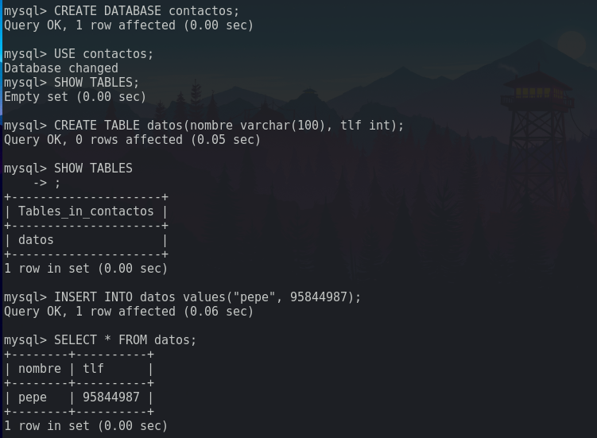
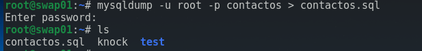
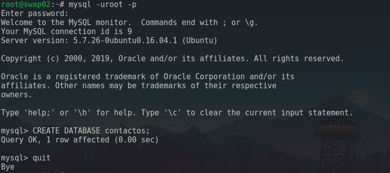
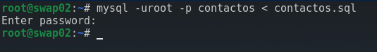
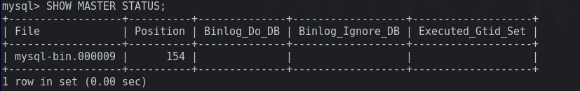
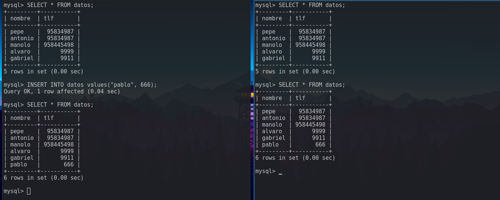

# Práctica 5. Replicación de bases de datos MySQL

Para completar esta práctica, debemos llevar a cabo las siguientes tareas:
-   Crear una BD con al menos una tabla y algunos datos
-   Clonar manualmente BD entre máquinas.
-   Configurar la estructura maestro-esclavo entre dos máquinas para realizar el
    clonado atuomático de la información.

## Creando la base de datos
Lo primero que haremos será crear la base de datos en una máquina para luego
replicarlo en otra. Utilizaremos las siguientes:
-   _swap01_: Servidor final 1. Será nuestra base de datos principal.
-   _swap02_: Servidor final 2. Será nuestra base de datos de repuesto.

En lenguaje de base de datos, hablamos de maestro cuando nos referimos al principal
y esclavo cuando es el de repuesto.

Crearemos la misma base de datos de ejemplo que utiliza el guión de la
asignatura. 


## Clonando la base de datos con _mysqldump_
Una vez que hemos creado la base de datos en el maestro, es momento de hacer la
copia en el esclavo. Para ello usaremos una herramienta llamada _mysqldump_. Lo
que hará será crearnos un archivo con las sentencias SQL necesarias para hacer una
copia exacta de la base de datos que le indiquemos. Por tanto, una vez tengamos
ese archivo, podremos ejecutar esas sentencias (obviamente no de una en una) en
otra máquina para clonar la base de datos.  

La sintaxis que sigue es la siguiente:
```bash
mysqldump -u<usuario> -p <base de datos> > <archivo.sql>
```


En nuestro case haremos:
```bash
mysqldump -uroot -p contactos > contactos.sql
```

Una vez tenemos este archivo, debemos pasarlo en el esclavo. Podemos hacer esto
de la misma manera que hemos hecho en prácticas anteriores, por ejemplo _scp_:
```bash
scp contactos.sql swap02:
```

Esto producirá una copia del archivo en nuestra máquina esclavo en la carpeta home del
usuario al que nos conectamos por defecto por _ssh_. Una vez tenemos el archivo
en _swap02_, tenemos que crear una base de datos que se llame exactamente igual
que en la máquina maestro:


Una vez creada, basta con ejecutar _mysql_ para que ejecute todas las sentencias
de _contactos.sql_:
```bash
mysql -uroot -p contactos < contactos.sql
```


Como te imaginas, esta manera manual de mantener clonadas dos bases de datos
hace agua por todas partes. Para empezar tenemos que estar haciéndolo
constantemente, puesto que en una base de datos en fase de producción está
cambiando a cada segundo. Además tendriamos que estar bloqueando constantemente
la base de datos para que no se modifique mientras se crea la copia (el archivo
SQL), lo que sería muy poco eficiente. Como solución a esto, se puede
implementar una estructura maestro-esclavo.

## Estructura maestro-esclavo en MySQL
Llegó el momento de hacer las cosas bien. Vamos a configurar los demonios de
MySQL para que se mantengan actualizadas. Como su propio nombre indica, ambas
partes no tendrán la misma función. El maestro será el modificado mientras que
el esclavo irá viendo que modificaciones se producen para hacerlas también a su
base de datos.  
Para hacer esto debemos cambiar el archivo de configuración de MySQL. En mi caso
_/etc/mysql/mysql.conf.d/myslqd.cnf_, concretamente las siguientes lineas:
```
#bind-address 127.0.0.1
log_error = /var/log/mysql/error.log
server-id = {id}
log_bin = /var/log/mysql/bin.log
```

Poniendo como _id_ al maestro 1 y al esclavo 2.  

Antes de escribirlo, es conveniente revisar si ya existen estas lineas y
modificarlas para dejarlas así, ya que la configuración por defecto de MySQL
suele traer esta configuración (al menos comentada). Una vez hecho esto,
bastaría con reiniciar el servicio en ambas máquinas:
```bash
systemctl restart mysql
```

Ya lo tenemos todo preparado, nos queda crear un usuario en el maestro para que
el esclavo pueda conectarse e indicarle al esclavo quien será su maestro. En el
maestro, para crear un usuario haremos lo siguiente:
```
mysql> CREATE USER esclavo IDENTIFIED BY 'esclavo';
mysql> GRANT REPLICATION SLAVE ON *.* TO 'esclavo'@'%' IDENTIFIED BY 'esclavo';
mysql> FLUSH PRIVILEGES;
mysql> FLUSH TABLES;
mysql> FLUSH TABLES WITH READ LOCK;
mysql> SHOW MASTER STATUS;
```

Este último comando nos muestra los datos necesarios que tenemos que introducir
en el esclavo para que pueda conectarse al maestro, concretamente el archivo y
la posición.  


En el esclavo introduciremos lo siguiente:
```
mysql> CHANGE MASTER TO MASTER_HOST='swap01',
       MASTER_USER='esclavo', MASTER_PASSWORD='esclavo',
       MASTER_LOG_FILE='{nombre de archivo}',
       MASTER_LOG_POS={posicion},
       MASTER_PORT=3306;
mysql> START SLAVE;
```

Una vez hecho esto, al hacer un cambio en el maestro, debería verse reflejado
instantáneamente en el esclavo. Aquí tenemos una prueba:

