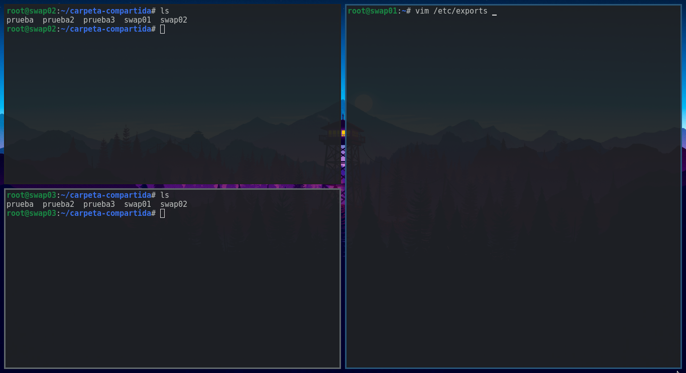
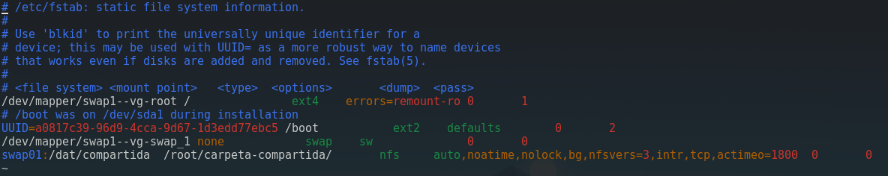
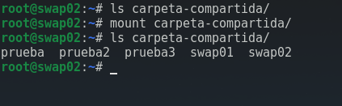

# Práctica 6. Servidor de disco NFS

Para completar esta práctica, debemos llevar a cabo las siguientes tareas:
-   Configurar una máquina como servidor de disco NFS y exportar una carpeta a
    los clientes
-   Montar en las máquinas cliente la carpeta exportada por el servidor.
-   Comprobar que todas las máquinas puedes acceder a los archivos almacenados
    en la carpeta compartida.
-   Hacer permanente la configuración en los clientes para que monten
    automáticamente la carpeta compartida al arrancar el sistema.

## Configurando una máquina como servidor de disco NFS
Lo primero que haremos será configurar el servidor NFS. Utilizaremos las
siguientes máquinas:
-   _swap01_: Será nuestro servidor NFS
-   _swap02_: Será uno de nuestros clientes
-   _swap03_: Será el otro clientes

Iremos a la máquina _swap01_ y, tras instalar los paquetes que nos indica el
guión, crearemos una carpeta con la siguiente configuración:
```bash
mkdir /dat/compartida
chown nobody:nogroup /dat/compartida
chmod -R 755 /dat/compartida
```

Esta será la carpeta que compartiremos. Ahora iremos al archivo _/etc/exports_ y
añadiremos lo siguiente:
```
/dat/compartida     swap02(rw)  swap03(rw)
```

Reiniciamos el servicio:
```bash
systemctl restart nfs-kernel-server
```

Ya no tendríamos que tocar más el servidor, llega la hora de los clientes.

## Configurando los clientes
En los clientes _swap02_ y _swap03_ deberemos hacer lo siguiente:

Tras instalar los paquetes que nos indica el guión, solo tendremos que montar la
carpeta
```bash
mkdir carpeta-compartida
mount swap01:/dat/compartida carpeta-compartida
```

Ya tenemos la carpeta y podemos acceder a ella y modificarla desde los clientes


## Configurando los clientes de manera persistente
Por último, configuraremos los clientes para que monte automáticamente la
carpeta compartida al iniciarse. Para ello, como es típico, modificaremos el
archivo _/etc/fstab_ añadiendo la siguiente linea:
```
swap01:/dat/compartida /root/carpeta-compartida nfs auto,noatime,nolock,bg,nfsvers=3,intr,tcp,actimeo=1800  0   0
```


Si lo hemos copiado correctamente, para comprobar que funciona podríamos hacer:
```
mount carpeta-compartida
```



Lo que hace esto es montar la carpeta siguiente las indicaciones que hay en
_/etc/fstab_. Si lo hace sin problemas, probamos a reiniciar y comprobaremos que
la carpeta se encuentra montada automáticamente.
